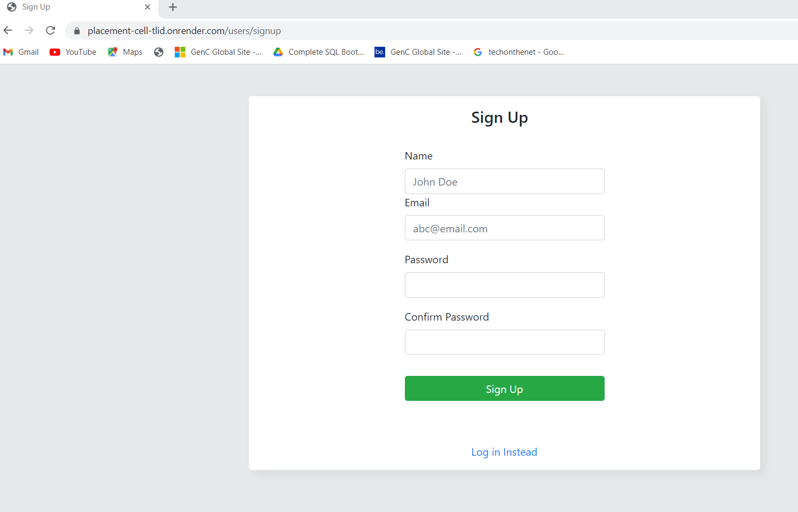
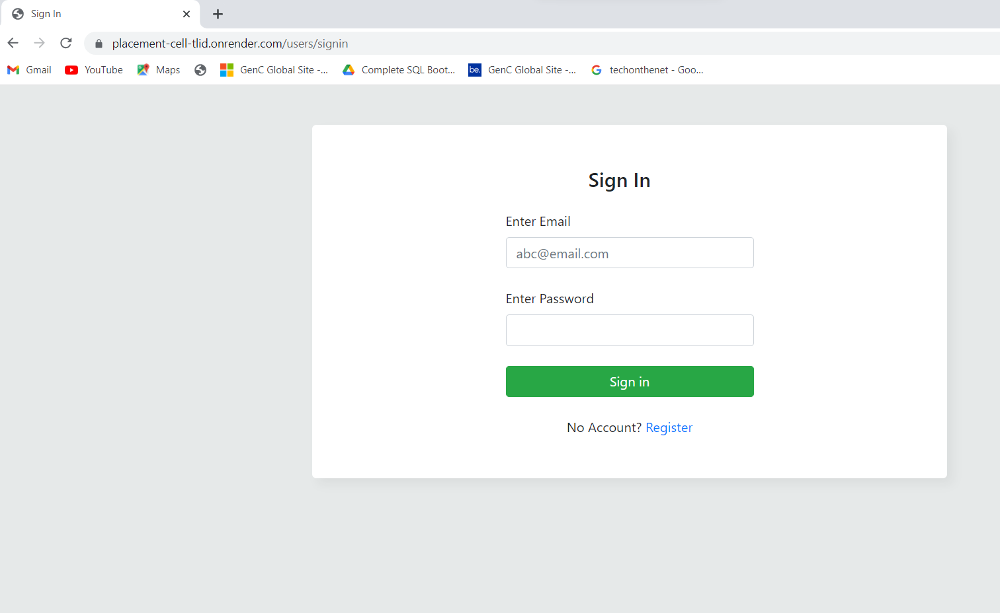
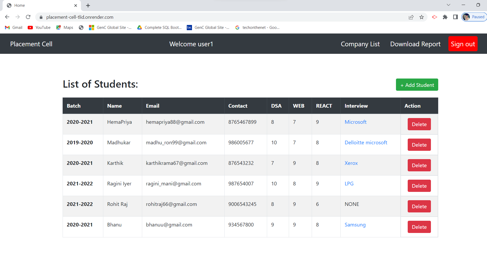
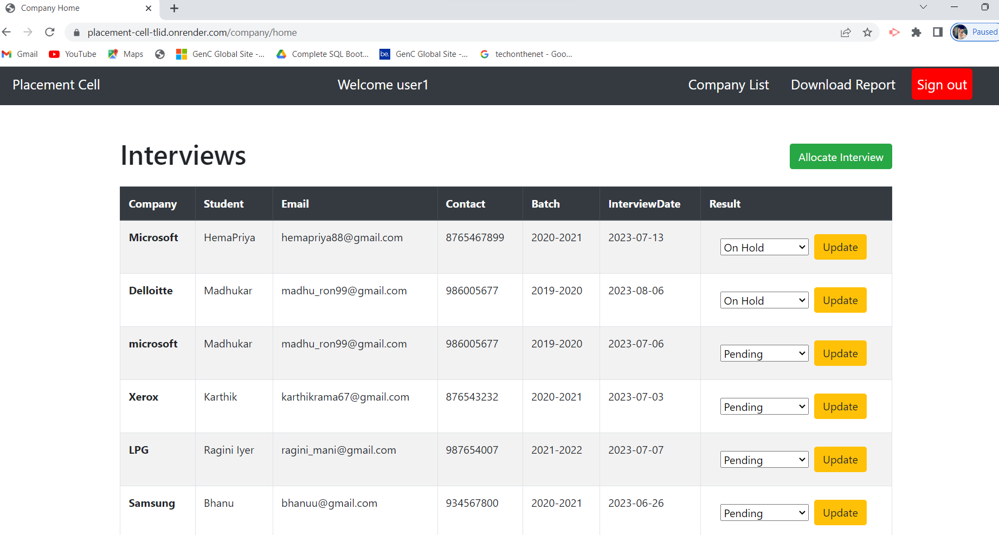
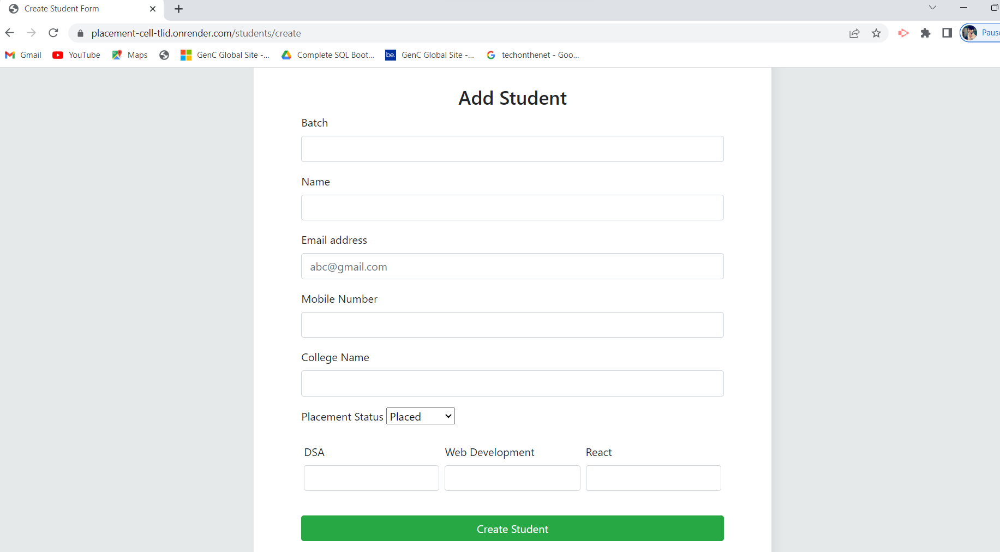
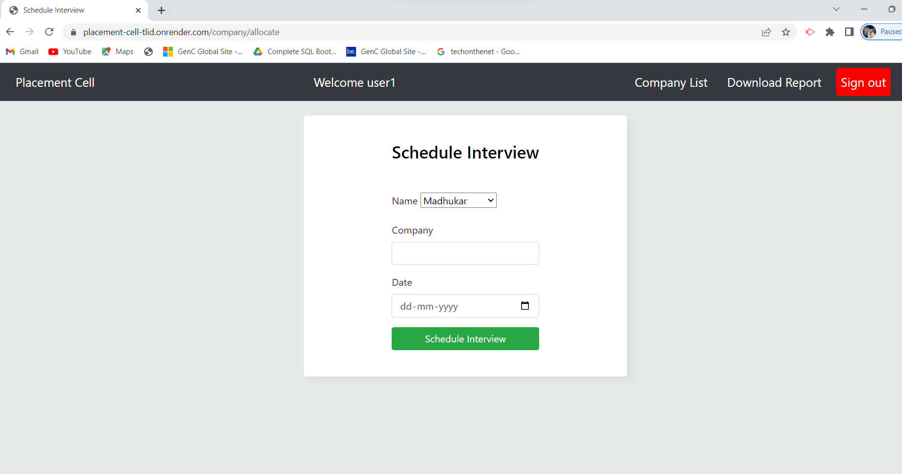

# Team Career Camp - Placement - Cell

This web application is designed for Team Career Camp to maintain a database of student interviews. It allows employees to input student details, interview information, and results, and provides the functionality to download the data in CSV format.

## Tech Stack

- Node.js
- MongoDB
- CSS and EJS template
- Passport.js (Used for Authentication)

## Packages Used

├── express@4.18.1
├── express-ejs-layouts@2.5.1
├── express-session@1.17.3
├── mongoose@6.3.3
├── node-fetch@2.6.7
├── nodemon@2.0.16
├── objects-to-csv@1.3.6
├── passport-local@1.0.0
├── passport@0.5.3
├── validator@13.7.0
├── connect-flash@0.1.1
├── connect-mongo@4.6.0
└── ejs@3.1.7

## Local Setup

To run this project on your local system, follow these steps:

1. Clone the repository from GitHub.
2. Extract the downloaded folder.
3. Open a terminal and navigate to the project directory.
4. Run the following command to install the required dependencies:

  Run `npm install` to install required dependencies
  Start the server using the following command `npm start`
  
## Features

- Employee Sign Up and Sign In with authentication using Passport.js.
- Add new students and view the list of students.
- Create interviews, allocate students to interviews, and mark result status.
- Download a complete CSV of all the data with the specified columns.
- Bonus Feature: External Jobs List, fetching real available jobs in India for React and Node.js from open APIs.
## Report 
A csv file is downloaded in the folder report as `data.csv` which contains the student details with all the placement information
## Live Demo

You can find the live demo of this project on GitHub:

[GitHub Repository](https://github.com/keerthy97/PLACEMENT_CELL_NODEJS)

## About

This web application was developed by [Keerthy] as part of a project for Coding Ninjas.

I hope this application proves to be a useful tool for maintaining student interview records. Happy interviewing!

## Screenshots

- Sign Up
  

- Sign In
  

- Student Page
  

- Interview Page
  

- Add student
  

- Schedule Interview
  

